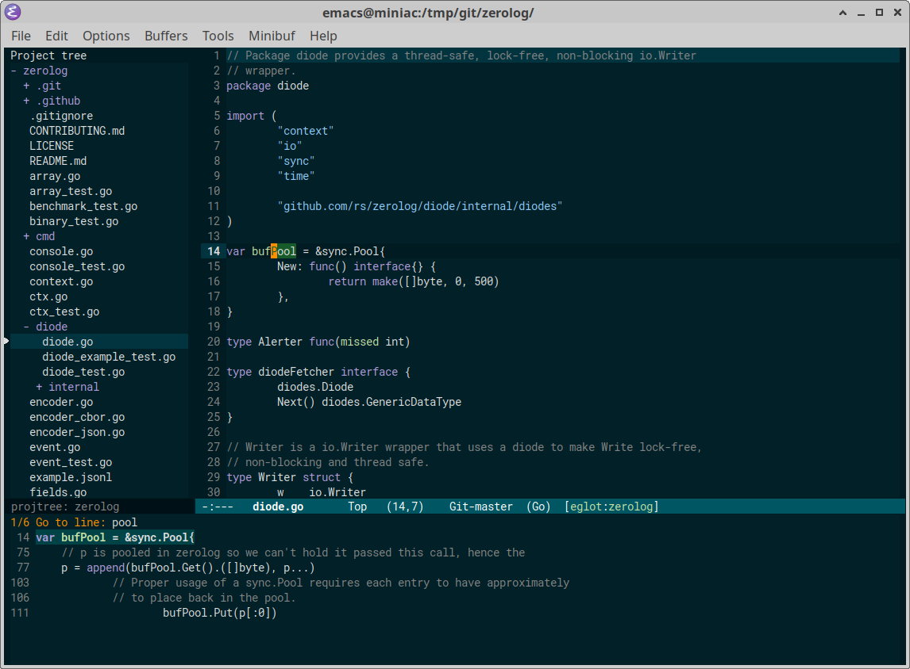
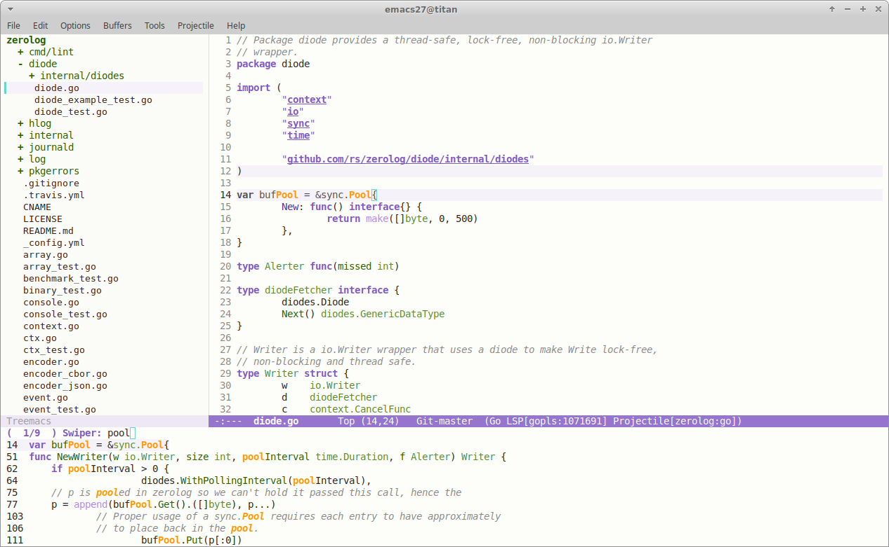

# Emacs immaterial-theme

_Note: for good results in a pure terminal environment, consider installing
Emacs 26 and
[enable truecolors](https://github.com/syl20bnr/spacemacs/wiki/Terminal) in your
terminal._

Immaterial is an emacs color theme that comes in two flavors: `immateral-dark`
and `immaterial-light`.

In its infancy it was loosely based on the principles of Google's
[Material design](https://material.io/design/color/the-color-system.html#color-theme-creation),
but that's all immaterial ...

Since then it has evolved to become a theme focused on readability and a sober
amount of coloring; enough to help you quickly grasp syntactical structure and
identify key elements without bombarding your senses with an undue amount of
colors (a lot of themes seem to take a "more is more" approach to coloring,
ending up in a christmas tree where no element stands out from the rest).

## Screenshots

### immaterial-dark

### immaterial-light

## Install

- From MELPA (or MELPA stable) via:

        M-x package-install RET immaterial-theme

        ;; load dark theme
        (load-theme 'immaterial-dark t)

        ;; ... or load light theme
        (load-theme 'immaterial-light t)

- Via `use-package`:

        (use-package immaterial-theme
          :ensure t
          :config
          (load-theme 'immaterial-dark t))

- By adding `immaterial-theme.el` to `~/.emacs.d/themes` and the following to
  your `init.el`:

        (add-to-list 'custom-theme-load-path "~/.emacs.d/themes")
        (load-theme 'immaterial-dark t)
