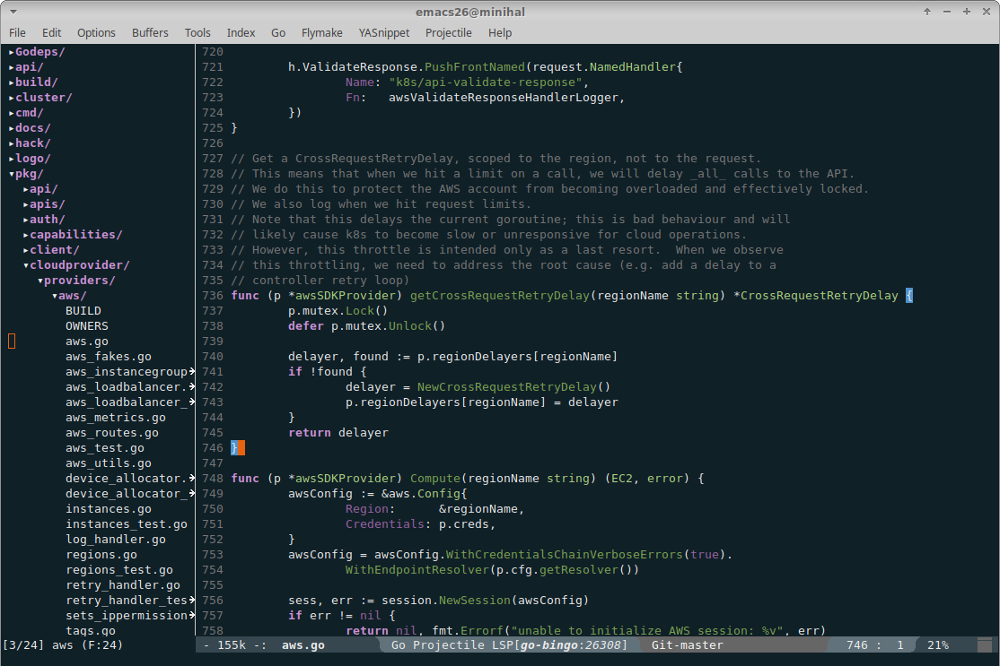
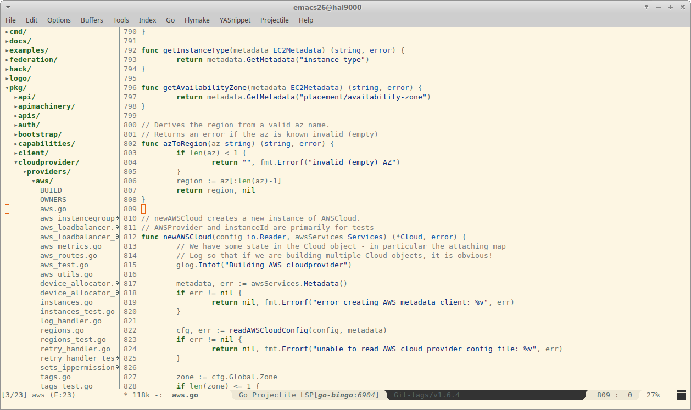

# emacs-immaterial-theme

*Note: for good results in a pure terminal environment, consider installing
Emacs 26 and [enable
truecolors](https://github.com/syl20bnr/spacemacs/wiki/Terminal) in your
terminal.*

Immaterial is an emacs color theme, loosely based on the principles of Google's
[Material
design](https://material.io/design/color/the-color-system.html#color-theme-creation). More
specifically, it defines (and allows users to _redefine_) the following coloring
elements:

- `background`: used for the background of buffers, modeline, etc.

  Comes in three flavors: `background-primary`, `background-secondary`,
  `background-tertiary` with falling degree of use in the theme.

- `foreground`: used for plain text and editor decorations of different kinds.

  Comes in three flavors: `foreground-primary`, `foreground-secondary`,
  `foreground-tertiary` with falling degree of use in the theme.

- `primary`: used for certain parts of the syntax highlighting (for example,
  keywords). Refer to [the code](immaterial-theme.el) for details.

  Comes in three variants, which are used to add some slight variation in the
  syntactic highlighting: `primary`, `primary-dark`, `primary-light`.

- `secondary`: used for certain parts of the syntax highlighting (for example,
  types and variables). Refer to [the code](immaterial-theme.el) for details.

  Comes in three variants, which are used to add some slight variation in the
  syntactic highlighting: `secondary`, `secondary-dark`, `secondary-light`.

- some additional colors for specific types of highlighting:

    - `error`: for highligting erroneous code.
    - `warning`: for highligting suspicious code.
    - `discrete`: for text that should be less pronounced (code comments, line
      numbers).
    - `cursor`: the color of the cursor.

The following are the full list of colors defined in the default
`immaterial-color-alist`:

 | Property               | Color                                                              |
 | --------               | -----                                                              |
 | `background-primary`   |  `#102027` |
 | `background-secondary` |  `#37474f` |
 | `background-tertiary`  |  `#62727b` |
 | `foreground-primary`   |  `#eeeeee` |
 | `foreground-secondary` |  `#dbdbdb` |
 | `foreground-tertiary`  |  `#c8c8c8` |
 | `primary`              |  `#4db6ac` |
 | `primary-light`        |  `#82e9de` |
 | `primary-dark`         |  `#00867d` |
 | `secondary`            |  `#aed581` |
 | `secondary-light`      |  `#e1ffb1` |
 | `secondary-dark`       |  `#7da453` |
 | `error`                |  `#ff5555` |
 | `warning`              |  `#e86310` |
 | `discrete`             |  `#777777` |
 | `cursor`               |  `#e86310` |

Each of these values can be overridden through the
`immaterial-color-override-alist` variable, which overrides the defaults in the
`immaterial-color-alist`. As an example, to provide a different primary color
palette:

    (setq immaterial-color-override-alist
      '(("primary"         . "#ffa726")
        ("primary-light"   . "#ffd95b")
        ("primary-dark"    . "#c77800")
        ))

**Note**: it is highly recommended to make use of the [Material color
tool](https://material.io/tools/color) to experiment with color palettes and
variants of a certain color.

**Note**: emacs [rainbow-mode](https://elpa.gnu.org/packages/rainbow-mode.html)
comes in handy for highlighting each hex color being edited in you emacs init
file.

## Screenshots

The default theme in `go-mode`:

With an updated `primary` palette:

    (setq immaterial-color-override-alist
      '(("primary"         . "#ce93d8")
        ("primary-light"   . "#ffc4ff")
        ("primary-dark"    . "#9c64a6")))

Updated to produce a light theme:

    (setq immaterial-color-override-alist
      '(("background-primary"    . "#fdf6e3")
        ("background-secondary"  . "#eee8d5")
        ("background-tertiary"   . "#bbb6a4")
        ("foreground-primary"    . "#566668")
        ("foreground-secondary"  . "#93a1a1")
        ("foreground-tertiary"   . "#839496")
        ("primary"         . "#1b5e20")
        ("primary-light"   . "#4c8c4a")
        ("primary-dark"    . "#003300")
        ("secondary"       . "#0d47a1")
        ("secondary-light" . "#5472d3")
        ("secondary-dark"  . "#002171")))

## Install

Add the `immaterial-theme.el` file to `~/.emacs.d/themes` and add the following to
your `init.el`:

     (add-to-list 'custom-theme-load-path "~/.emacs.d/themes")
     (load-theme 'immaterial t)

You may optionally customize the theme via `immaterial-color-override-alist`. For
example:

    (setq immaterial-color-override-alist
          '(("primary"         . "#ffa726")
            ("primary-light"   . "#ffd95b")
            ("primary-dark"    . "#c77800")
            ))
